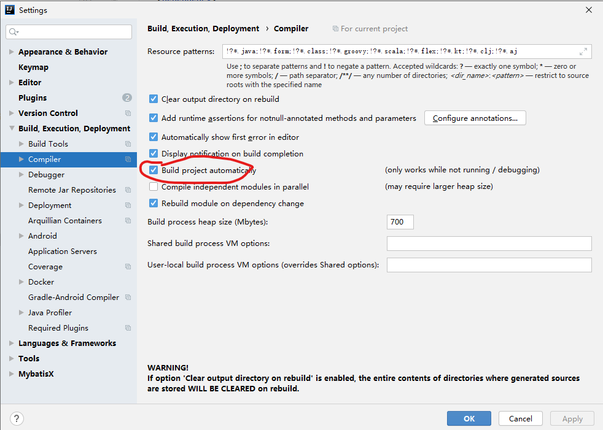
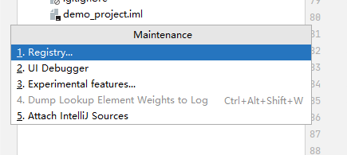
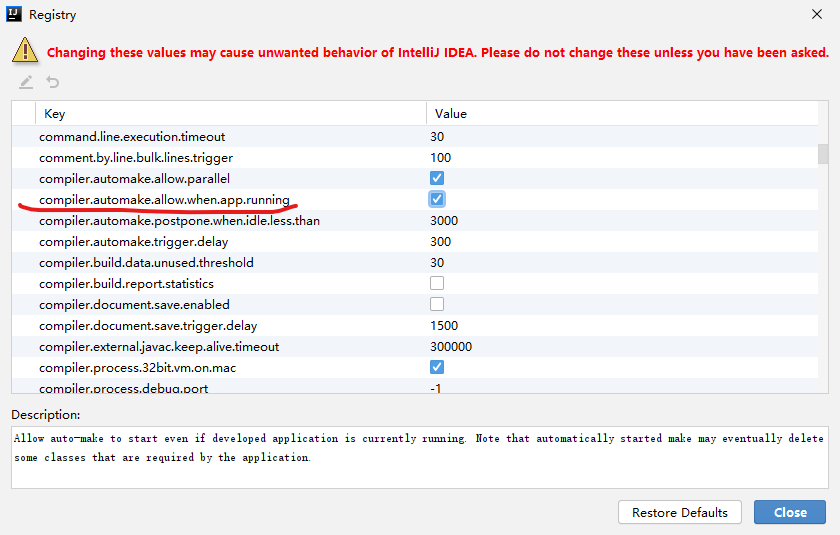

## IDEA热部署

#### 1、添加依赖


```xml
<dependency>
    <groupId>org.springframework.boot</groupId>
    <artifactId>spring-boot-devtools</artifactId>
    <optional>true</optional>
</dependency>

<build>
    <plugins>
        <plugin>
            <groupId>org.springframework.boot</groupId>
            <artifactId>spring-boot-maven-plugin</artifactId>
            <configuration>
            	<fork>true</fork>   <!--热部署需要这个配置-->
            </configuration>
        </plugin>
    </plugins>
</build>
```


#### 2、系统配置（Mac/windows相同）




使用快捷键打开，选择Registry

> windows快捷键：shift+ctrl+alt+/
>
> mac快捷键：shift+command+alt+/ 





勾选如下选项，重启IDEA即可


