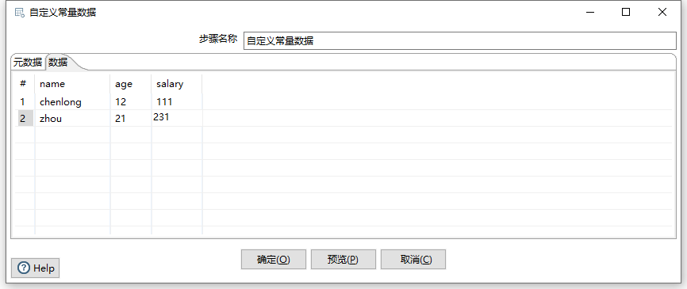
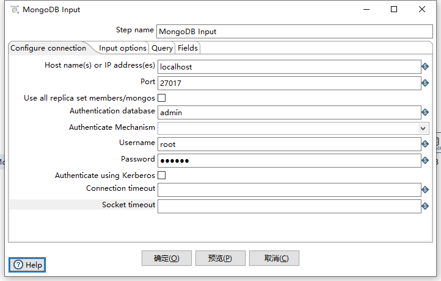

# 造数据

### 生成记录

> 用于生成一批数据，每一行都相同

### 自定义常量数据

> 用于生成一批数据，可以设置不同的数据

# 字段拦截过滤

> 以下这些组件可以过滤流中的字段，使得只将部分字段放入流中往后传

### 字段选择

### Json output

> 这个控件也会过滤掉不使用的字段，因为他是一个输出控件，而输出控件会将不要的字段从流中删除

# mongodb

### mongodb output

- Connection timeout：尝试连接数据库所等待的最大时间（毫秒），空为无限，建议5000
- Socket timeout：sql在执行成功之前等待读写操作的时间（毫秒），空为无限，建议5000

- database：待连接的数据库，注意和前面用于用户鉴权的数据库的区别
- collection：待连接的集合，相当于表
- batch insert size：多少条数据插入一次
- truncate collection：在数据传输前清空表
- update：是否更新
- upsert：是否插入
- multe-update：更新所有匹配的文档，默认是只更新符合查询条件的第一个
- Modifier update：允许修饰符运算符用于修改匹配文档中的各个字段（$运算符），此类更新速度快，涉及的网络流量最小。只有当这个选项选中时，Mongo Document Fields Tab 的 Modifier operation 和 Modifier policy 才会生效

输入字段与查询条件

- Name：字段名
- Mongo document path：字段路径，可以为 Name 设置新字段名

示例

- Use field name：为 N 时字段会使用 Mongo document path 为新字段名
- JSON：以 json 格式存储数据
- Match field for update：为 Y 的字段将作为查询条件
- Modifier operation：当 Output Options Tab 的 Modifier update 选中时，此设置生效，其中，N/A 为不更新，\$set 为覆盖更新 \$inc 为数字的加法更新，$push 为数组的追加更新

- Modifier policy：当 Output Options Tab 的 Modifier update 选中时，此设置生效，其中，Insert 为插入，Update 为更新，可为不同字段设置不同的更新方法

### mongodb input

> mongodb input前面不要加其他组件，否则会导致数据与字段位移

- Host name(s) or IP address(es)：网络名称或者地址。可以输入多个主机名或IP地址，用逗号分隔。还可以通过将主机名和端口号与冒号分隔开，为每个主机名指定不同的端口号，并将主机名和端口号的组合与逗号分隔开。

  例如，要为两个不同的MongoDB实例包含主机名和端口号，您将输入localhost 1:27017，localhost 2:27018，并使端口字段为空

  Use all replica set members/mongos：
  Port：端口号
  Username：用户名
  Password：密码
  Authenticate using Kerberos：指示是否使用Kerberos服务来管理身份验证过程。
  Connection timeout：连接超时时间（毫秒）
  Socket timeout：等待写操作（以毫秒为单位）的时间

Database：检索数据的数据库的名称。单击Get DBs以在服务器上的数据库列表填充下拉菜单。
Collection：集合名称。点击 Get collections以在数据库中包含一个集合列表来填充下拉菜单
Read preference：表示要先读取哪个节点
Tag set specification/#/Tag Set：标签允许您自定义写关注和读取副本的首选项

查询选项卡使您能够改进读请求。这个选项卡以两种不同的模式运行。您可以使用JSON查询表达式或使用聚合框架来创建查询。默认情况下，查询选项卡是JSON查询表达式模式。您可以输入一个JSON查询表达式。当选Query is aggregation pipeline 的时候，使用聚合表达式查询，是一种类似与json的查询语言。

Query expression (JSON)：查询表达式（JSON）（Query is aggregation pipeline没被选择的情况下）
{ name : "MongoDB" } 或者{ name : { '\$regex' : "m.*", '$options' : "i" } }

Query is aggregation pipeline：将多个JSON表达式连接在一起，立即执行。聚合管道将几个JSON表达式串在一起，前面的表达式的输出将成为下一个表达式的输入。
Aggregation pipeline specification (JSON)：聚合管道规范（JSON）（Query is aggregation pipeline被选择）
{ \$match : {state : "FL", city : "ORLANDO" } }, {​\$sort : {pop : -1 } }或者{ ​\$group : { _id: "\$state"} }, { \$sort : { _id : 1 } }

Execute for each row：对每一行数据执行查询
Fields expression (JSON)：Query is aggregation pipeline没被选中时候有效，控制字段返回

### 注意点：

##### 1、用户权限数据库admin

首次安装mongodb数据库，需要设置用户权限表admin，鉴权时会用到

> use admin
>
> db.system.users.remove({})
>
> db.createUser({ user: "root", pwd: "111111", roles: [ { role: "root", db: "admin"} ]})

# 网络请求

### Rest Client

###### 注意点：

设置header时需要注意，get请求可以正确设置header，但是post请求必须指定body体才能使header生效，否则后端无法收到header

### HTTP Post

### HTTP client

> 只支持get请求，相当于HTTP Get

# 数据库

### 表输入

### 数据库查询

### 数据库连接

> 数据库连接不能放在起始节点，否则查不到数据，可以在前面加一个节点

### 区别：

【表输入】和【数据库连接】会将满足条件的所有数据都输出出来，而【数据库查询】只将满足条件的第一条数据输出出来。
【数据库查询】和【数据库连接】中返回的查询字段会加入到原始的输入流字段中（如果原始输入流字段与查询返回的字段重名，默认会对查询字段命进行更改）。而【表输入】操作只返回查询字段。这一点很重要，会对后续步骤产生影响。
【表输入】使用前述步骤提供的字段时，字段数量必须与where子句中用到的字段数量一致。而【数据库连接】可以指定使用字段。

