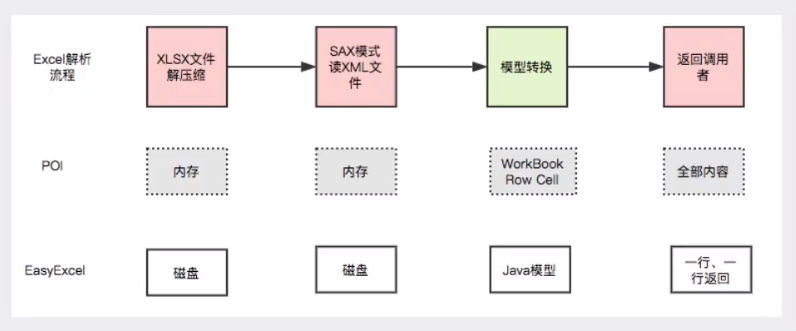
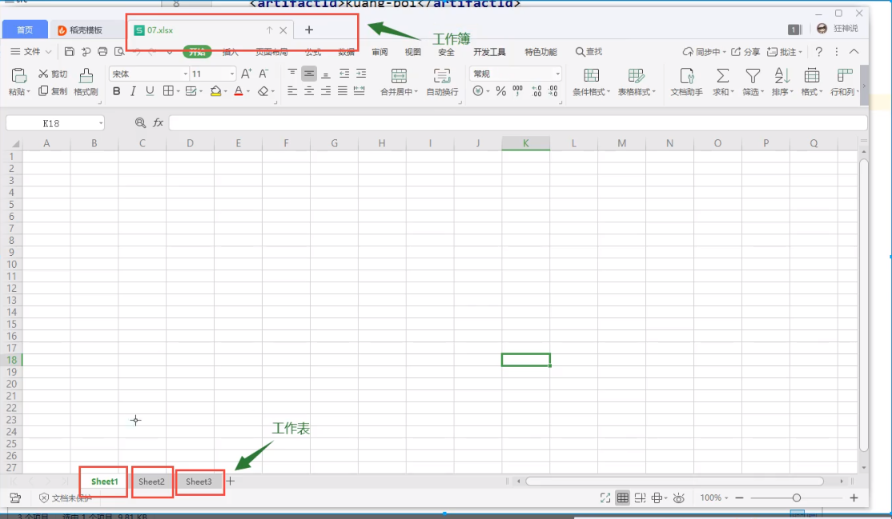

## POI和easyExcel





#### 一、Apache POI

> POI提供了API给java程序对Microsoft Office格式档案的读写功能，如Excel、Word、PowerPoint、Visio


###### 1、导入依赖

```xml
<!--xls   03版-->
<dependency>
    <groupId>org.apache.poi</groupId>
    <artifactId>poi</artifactId>
    <version>3.9</version>
</dependency>
<!--xlsx   07版本-->
<dependency>
    <groupId>org.apache.poi</groupId>
    <artifactId>poi-ooxml</artifactId>
    <version>3.9</version>
</dependency>
<!--日期格式化工具-->
<dependency>
    <groupId>joda-time</groupId>
    <artifactId>joda-time</artifactId>
    <version>2.10.6</version>
</dependency>
```

###### 2、了解excel

> 版本注意：03版本的xls最多允许65536行数据，而07版本的xlsx则无限制
>
> 一个excel文件相当于一个工作簿，里面的sheet就是工作表，一个工作簿里面可以包含许多工作表，所以有如下几个对象
>
> 工作簿：Workbook
>
> 工作表：Sheet
>
> 行：Row
>
> 列：Cell




###### 3、写入操作excel  03版本

```java
private String path = "D:\\maven_workspace\\demo_project";

/**
 * 03版本的excel
 */
@Test
public void excel03() throws IOException {

    //1、创建一个工作簿
    HSSFWorkbook hssfWorkbook = new HSSFWorkbook();

    //2、创建一个工作表
    HSSFSheet sheet = hssfWorkbook.createSheet("工作表一");

    //3、创建一行
    HSSFRow row1 = sheet.createRow(0);

    //4、创建一个单元格
    HSSFCell cell00 = row1.createCell(0);
    cell00.setCellValue("姓名");
    HSSFCell cell01 = row1.createCell(1);
    cell01.setCellValue("陈龙");

    //再创建一行
    HSSFRow row2 = sheet.createRow(1);
    HSSFCell cell10 = row2.createCell(0);
    cell10.setCellValue("年龄");
    HSSFCell cell11 = row2.createCell(1);
    cell11.setCellValue(21);

    //5、创建一个流
    FileOutputStream fileOutputStream = new FileOutputStream(path + "03.xls");

    //6、保存文件
    hssfWorkbook.write(fileOutputStream);
    fileOutputStream.close();
}
```


###### 4、写入操作excel  07版本

> 代码基本不变，只不过将工作簿对象改为 ==XSSFWorkbook==，然后将生成的文件改为xlsx格式


###### 5、两种版本对比

> 03版速度快，数据保存在内存中然后一次写入，但是最多只能写65536行数据
>
> 07版速读慢，但是不限制保存的数据量

对07版速度过慢的优化：

> 使用 ==SXSSFWorkbook== 替换 ==XSSFWorkbook==。代码依旧不用改，只不过他会生成临时文件，在最后需要调用==SXSSFWorkbook== 的==dispose()==方法清除临时文件


###### 6、读取操作

```java
@Test
    public void readXls() throws IOException {
        //创建文件流
        FileInputStream fileInputStream = new FileInputStream(path + "03.xls");

        //创建工作簿
        HSSFWorkbook hssfWorkbook = new HSSFWorkbook(fileInputStream);

        //得到表
        HSSFSheet sheet = hssfWorkbook.getSheetAt(0);

        //得到行
        HSSFRow row = sheet.getRow(0);

        //得到cell
        HSSFCell cell = row.getCell(0);
//        System.out.println(cell.getStringCellValue());

        fileInputStream.close();
    }
```


读取标题数据

```java
//标题：一般标题都是放在第一行，下面就是如何解析一整行的数据
HSSFRow titleRow = sheet.getRow(0);
if (titleRow != null){
    int colNum = titleRow.getPhysicalNumberOfCells();
    for (int index=0; index<colNum; index++){
        HSSFCell titleCell = titleRow.getCell(index);
        if (titleCell != null){
            int cellType = titleCell.getCellType();    //这个类型是一个枚举数字
            String title = titleCell.getStringCellValue();
            System.out.println(cellType);
            System.out.println(title);
        }

    }
}
```


读取行

```java
int rowCount = sheet.getPhysicalNumberOfRows();
for (int index=0; index<rowCount; index++){
    HSSFRow rowData = sheet.getRow(index);
    if (rowData != null){
        //读取列
        int cellCount = titleRow.getPhysicalNumberOfCells();
        for (int i=0; i<cellCount; i++){
            HSSFCell cell1 = rowData.getCell(i);
            if (cell1!=null){
                int cellType = cell1.getCellType();
                String cellValue = "";
                switch (cellType){
                    case HSSFCell.CELL_TYPE_NUMERIC:   //数字（日期，普通数字）
                        if (HSSFDateUtil.isCellDateFormatted(cell1)){
                            //日期
                            Date dateCellValue = cell1.getDateCellValue();
                            String s = new DateTime(dateCellValue).toString("yyyy-MM-dd HH:mm:ss");

                        }else {
                            //普通数字
                            double numericCellValue = cell1.getNumericCellValue();
                        }
                        break;
                    case HSSFCell.CELL_TYPE_STRING:   //字符串
                        cellValue = cell1.getStringCellValue();
                        break;
                    case HSSFCell.CELL_TYPE_FORMULA:   //公式
                        String cellFormula = cell1.getCellFormula();
                        break;
                    case HSSFCell.CELL_TYPE_BLANK:   //空
                        break;
                    case HSSFCell.CELL_TYPE_BOOLEAN:   //布尔
                        boolean booleanCellValue = cell1.getBooleanCellValue();
                        break;
                    case HSSFCell.CELL_TYPE_ERROR:   //
                        break;
                }
            }
        }
    }
}
```


#### 二、easyExcel