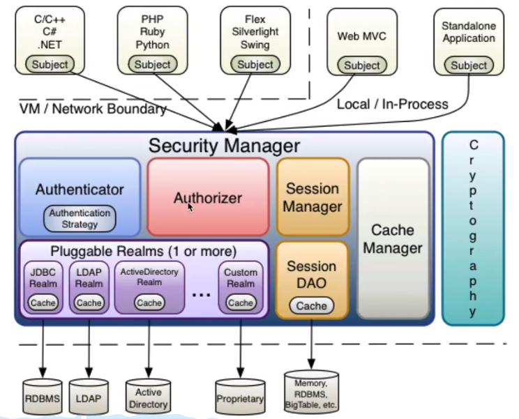
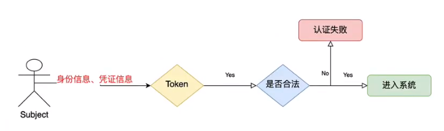
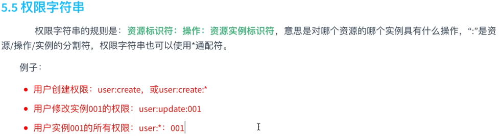
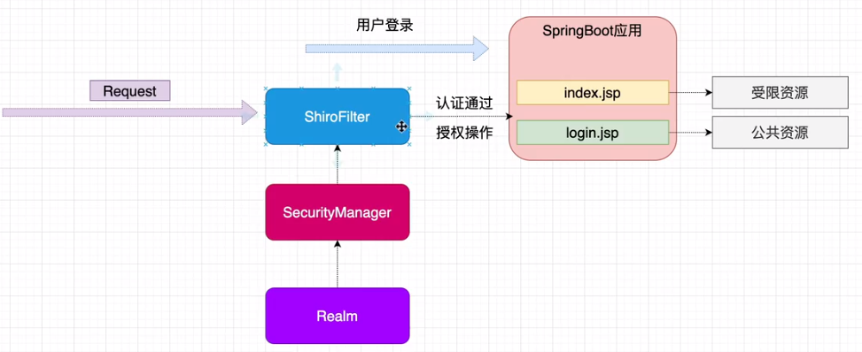
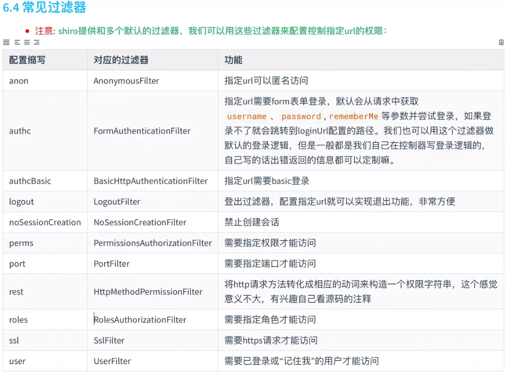
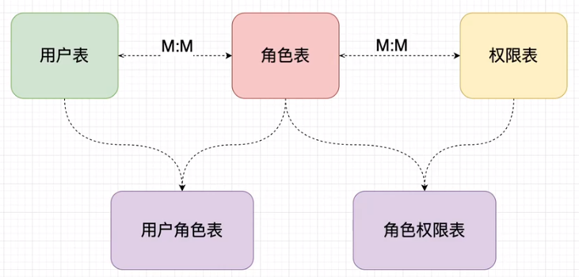

# Shiro

## 一、初识

#### 权限管理

> 权限管理分为==身份验证==和==授权==两部

**身份验证：**相当于判断用户的登陆状态，判断是否又该用户

**授权：**验证用户是否具有操作某些资源的权限


#### 基本概念




==Subject== 主体，外部应用于subject进行交互，subject记录了当前操作的用户

> Principal: 身份信息，是主题进行身份认证的标识，具有唯一性，如用户名、手机号。一个主题可以有多个身份，但必须只有一个主身份（Primary Principal）
>
> credential： 凭证信息，如密码证书

==SecurityManager== 安全管理器，对subject进行安全管理，完成对subject的认证与授权

==Authenticator== 认证器

==Authorizer== 授权器

==Realm== 领域，相当于数据源，securityManager进行安全认证需要通过Realm获取用户权限数据，它不仅会获取用户权限数据，还会包含认证授权校验的相关代码

#### 认证流程



> subject在认证时要把身份信息和凭证信息组装成一个令牌，交给安全管理器认证，安全管理器又交给具体的realm做处理


## 二、认证

==单纯使用shiro，不和其他框架做整合==

#### 1、首先引入shiro依赖

#### 2、创建shiro.ini配置文件

在使用spring整合之后就不需要写这个配置文件了，主要用来写权限数据，实际开发中权限数据是写在数据库中的，因此也不需要这个配置文件

> ```ini
> # 用户名=密码
> [users]
> chenlong=111111
> zhangsan=12312
> ```

#### 3、简单示例

```java
public static void main(String[] args) {

    //1、创建安全管理器对象
    DefaultSecurityManager securityManager = new DefaultSecurityManager();

    //2、给安全管理器设置realm realm提供具体的数据访问
    securityManager.setRealm(new IniRealm("classpath:shiro.ini"));

    //3、给全局安全工具类设置安全管理器
    SecurityUtils.setSecurityManager(securityManager);

    //4、关键对象 subject主体 主体需要登录或者登出系统，因此它有login()和logout()方法
    Subject subject = SecurityUtils.getSubject();

    //5、创建令牌并登录系统，开始验证过程，如果验证通过不会有异常，否则抛异常
    UsernamePasswordToken token = new UsernamePasswordToken("chenlong","111111");
    try {
        System.out.println("认证状态：" + subject.isAuthenticated());
        subject.login(token);
        System.out.println("认证状态：" + subject.isAuthenticated());
    }catch (UnknownAccountException e){
        e.printStackTrace();
        System.out.println("用户不存在");
    }catch (IncorrectCredentialsException e){
        e.printStackTrace();
        System.out.println("密码错误");
    }
}
```

#### 4、核心realm和方法

AuthenticatingRealm 用于用户认证的realm，具体认证方法为doGetAuthenticationInfo()

AuthorizingRealm 用于授权的realm，具体授权方法为doGetAuthorizationInfo()

#### 5、自定义realm

>上面简单示例中用到的是IniRealm，IniRealm的数据来源是shiro.ini文件
>
>通过自定义realm可以自定义数据来源
>
>自定义realm需要继承AuthorizingRealm，并重写认证和授权的方法

```java
/**
 * 自定义realm，将认证授权的数据来源转为数据库或其他数据源
 * 因为实际应用中用户的授权数据存储在数据库
 */
public class CustomRealm extends AuthorizingRealm {

    //授权
    @Override
    protected AuthorizationInfo doGetAuthorizationInfo(PrincipalCollection principalCollection) {
        return null;
    }

    //认证
    @Override
    protected AuthenticationInfo doGetAuthenticationInfo(AuthenticationToken authenticationToken) throws AuthenticationException {
        //在token中获取用户名
        String principal = (String) authenticationToken.getPrincipal();
        System.out.println("用户名：" + principal);
        char[] credentials = (char[])authenticationToken.getCredentials();
        System.out.println("密码：" + new String(credentials));
        //数据库中查询用户信息
        String username = "chenlong";
        String passeord = "111111";

        //对比用户名
        if (principal.equals(username)){
            //参数1：数据库中正确的用户名 参数2：数据中查到的正确密码 参数3：该realm的名字
            //参数1和参数3没有实际意义，主要是打印日志时使用
            SimpleAuthenticationInfo authenticationInfo = new SimpleAuthenticationInfo(principal,passeord,getName());
            return authenticationInfo;
        }
        return null;   //用户不存在
    }
}
```

```java
public static void main(String[] args) {

    //1、创建安全管理器对象
    DefaultSecurityManager securityManager = new DefaultSecurityManager();

    //2、给安全管理器设置realm realm提供具体的数据访问
    securityManager.setRealm(new CustomRealm());

    //3、给全局安全工具类设置安全管理器
    SecurityUtils.setSecurityManager(securityManager);

    //4、关键对象 subject主体 主体需要登录或者登出系统，因此它有login()和logout()方法
    Subject subject = SecurityUtils.getSubject();

    //5、创建令牌并登录系统，开始验证过程，如果验证通过不会有异常，否则抛异常
    UsernamePasswordToken token = new UsernamePasswordToken("chenlong","111111");
    try {
        System.out.println("认证状态：" + subject.isAuthenticated());
        subject.login(token);
        System.out.println("认证状态：" + subject.isAuthenticated());
    }catch (UnknownAccountException e){
        e.printStackTrace();
        System.out.println("用户不存在");
    }catch (IncorrectCredentialsException e){
        e.printStackTrace();
        System.out.println("密码错误");
    }
}
```

#### 6、配置密码加密

通常密码都会进行MD5加密存入数据库，因此从数据库中查到的的密码是MD5之后的密文

需要指定密码加密规则否则认证无法通过

```java
/**
 * 自定义realm，将认证授权的数据来源转为数据库或其他数据源
 * 因为实际应用中用户的授权数据存储在数据库
 */
public class CustomRealm extends AuthorizingRealm {

    //授权
    @Override
    protected AuthorizationInfo doGetAuthorizationInfo(PrincipalCollection principalCollection) {
        return null;
    }

    //认证
    @Override
    protected AuthenticationInfo doGetAuthenticationInfo(AuthenticationToken authenticationToken) throws AuthenticationException {
        //在token中获取用户名
        String principal = (String) authenticationToken.getPrincipal();
        //数据库中查询用户信息
        String username = "chenlong";
        String passeord = "djs00d7fvd2ls8dhx7gww1hdeyah72s2";    //md5 + salt + 1024次散列
        String salt = "S0lxddaL";

        //对比用户名
        if (principal.equals(username)){
            //参数1：数据库中正确的用户名 
            //参数2：数据中查到的经过MD5 + salt + 1024次散列之后的密码
            //参数3：数据库中保存的盐值
            //参数4：该realm的名字
            SimpleAuthenticationInfo authenticationInfo = new SimpleAuthenticationInfo(principal,
                                                                                        passeord, 
                                                                            ByteSource.Util.bytes(salt),
                                                                                        getName());
            return authenticationInfo;
        }
        return null;   //用户不存在
    }
}
```

```java
public static void main(String[] args) {

    DefaultSecurityManager securityManager = new DefaultSecurityManager();

    CustomRealm customRealm = new CustomRealm();

    HashedCredentialsMatcher matcher = new HashedCredentialsMatcher();
    matcher.setHashAlgorithmName("md5");   //设置加密算法
    matcher.setHashIterations(1024);       //设置散列次数
    customRealm.setCredentialsMatcher(matcher);

    securityManager.setRealm(customRealm);
    SecurityUtils.setSecurityManager(securityManager);
    Subject subject = SecurityUtils.getSubject();
    UsernamePasswordToken token = new UsernamePasswordToken("chenlong","111111");
    try {
        subject.login(token);
        System.out.println("登陆成功");
    }catch (UnknownAccountException e){
        e.printStackTrace();
        System.out.println("用户不存在");
    }catch (IncorrectCredentialsException e){
        e.printStackTrace();
        System.out.println("密码错误");
    }
}
```

## 三、授权

#### 1、授权方式

- 基于角色的访问控制

  ```java
  //如果该主体拥有admin角色
  if(subject.hasRole("admin")){
      //操作什么资源
  }
  ```

- 基于资源的访问控制

  ```java
  //该主体是否拥有user的create权限
  if(subject.isPermission("user:create")){
      
  }
  ```


#### 2、权限字符串



#### 3、授权实现方式

- 编程式

  ```java
  if(subject.hasRole("admin")){
      //有权限
  }else{
      //无权限
  }
  ```

- 注解式

  ```java
  @RequiresRoles("admin")
  public void hello(){
      //有权限
  }
  ```

- 标签式

  > 在具体页面中使用shiro标签，jsp页面可以直接使用，而Thymeleaf页面中使用shiro标签需要额外集成

  ```jsp
  <shiro:hasRole name="admin">
      有权限
  </shiro:hasRole>
  ```

  

#### 4、权限验证

```java
/**
 * 自定义realm，将认证授权的数据来源转为数据库或其他数据源
 * 因为实际应用中用户的授权数据存储在数据库
 */
public class CustomRealm extends AuthorizingRealm {

    //授权
    @Override
    protected AuthorizationInfo doGetAuthorizationInfo(PrincipalCollection principalCollection) {
        String primaryPrincipal = (String) principalCollection.getPrimaryPrincipal();
//        System.out.println("身份信息：" + primaryPrincipal);

        //根据身份信息 用户名 获取当前用户的角色信息权限信息
        SimpleAuthorizationInfo simpleAuthorizationInfo = new SimpleAuthorizationInfo();
        //将数据库中查询角色信息赋值给权限对象
        simpleAuthorizationInfo.addRole("admin");
        simpleAuthorizationInfo.addRole("user");

        //将数据库中查询的权限字符串信息
        simpleAuthorizationInfo.addStringPermission("user:*:001");


        return simpleAuthorizationInfo;
    }
}
```

```java
public static void main(String[] args) {

    DefaultSecurityManager securityManager = new DefaultSecurityManager();

    CustomRealm customRealm = new CustomRealm();

    HashedCredentialsMatcher matcher = new HashedCredentialsMatcher();
    matcher.setHashAlgorithmName("md5");   //设置加密算法
    matcher.setHashIterations(1024);       //设置散列次数
    customRealm.setCredentialsMatcher(matcher);

    securityManager.setRealm(customRealm);
    SecurityUtils.setSecurityManager(securityManager);
    Subject subject = SecurityUtils.getSubject();
    UsernamePasswordToken token = new UsernamePasswordToken("chenlong","111111");
    try {
        subject.login(token);
        System.out.println("登陆成功");
    }catch (UnknownAccountException e){
        e.printStackTrace();
        System.out.println("用户不存在");
    }catch (IncorrectCredentialsException e){
        e.printStackTrace();
        System.out.println("密码错误");
    }

    //角色判断
    //判断是否拥有该角色
    System.out.println(subject.hasRole("admin"));
    //判断是否拥有全部角色
    System.out.println(subject.hasAllRoles(Arrays.asList("admin","user")));
    //判断是否拥有其中一个角色
    boolean[] booleans = subject.hasRoles(Arrays.asList("admin", "super", "user"));
    for(boolean i : booleans){
        System.out.println(i);
    }
    //权限判断
    System.out.println(subject.isPermitted("user:create:001"));
    //分别具有哪些权限
    System.out.println(subject.isPermitted("user:create:001","pubduct:add"));
    //同时具有哪些权限
    System.out.println(subject.isPermittedAll("user:create:001","pubduct:add"));
}
```


## 四、整合springboot



> 没有使用shiro之前，用户登录之后并没有做权限校验的操作
>
> 使用shiro的ShiroFilter拦截所有请求，并交给SecurityManager做认证和授权的操作


#### 1、引入依赖

```xml
       <!--权限验证框架-->
<!--      <dependency>-->
<!--         <groupId>org.apache.shiro</groupId>-->
<!--         <artifactId>shiro-spring</artifactId>-->
<!--         <version>1.4.0</version>-->
<!--      </dependency>-->
      <dependency>
         <groupId>org.apache.shiro</groupId>
         <artifactId>shiro-spring-boot-starter</artifactId>
         <version>1.5.3</version>
      </dependency>
```

#### 2、创建shiro配置类

> 配置过滤器、安全管理器以及realm

> 注意：web环境下要使用DefaultWebSecurityManager这个安全管理器




```java
@Configuration
public class ShiroConfig {

    /**
     * 创建shiro过滤器
     */
    @Bean
    public ShiroFilterFactoryBean getShiroFilterFactoryBean(@Qualifier("securityManager") DefaultWebSecurityManager securityManager){
        ShiroFilterFactoryBean shiroFilterFactoryBean = new ShiroFilterFactoryBean();

        //设置安全管理器
        shiroFilterFactoryBean.setSecurityManager(securityManager);

        /**
         * 配置系统受限资源和公共资源  公共资源不需要登录
         * 添加shiro内置过滤器,可以实现权限相关的拦截器
         * 常用过滤器：
         *     anon：无需认证（登录）可以访问
         *     authc：必须认证才可访问
         *     user：如果使用rememberMe的功能可以直接访问
         *     perms：该资源必须得到资源权限才可以访问
         *     role：该资源必须得到角色权限才可以访问
         */
        LinkedHashMap<String, String> filterMap = new LinkedHashMap<>();
        //不受限的公共资源要设置在上面
        filterMap.put("/api/v1/test/login","anon");
        //受限资源设置在下面
        filterMap.put("/api/v1/test/*","authc");

        //授权过滤器，未授权则会自动跳转未授权界面
        filterMap.put("/api/v1/test/add","perms[user:add]");    //表明该页面或者该接口需要user:add权限

        //设置未登录时跳转的页面  如果subject未认证则会跳转如下界面  这个资源不需要认证
        shiroFilterFactoryBean.setLoginUrl("/api/v1/test/toLogin");
        //设置未授权时跳转的页面
        shiroFilterFactoryBean.setUnauthorizedUrl("/api/v1/test/toUnAuth");


        shiroFilterFactoryBean.setFilterChainDefinitionMap(filterMap);

        return shiroFilterFactoryBean;
    }

    /**
     * 创建权限管理着
     */
    @Bean("securityManager")
    public DefaultWebSecurityManager getDefaultWebSecurityManager(@Qualifier("customRealm") CustomRealm customRealm){
        DefaultWebSecurityManager securityManager = new DefaultWebSecurityManager();
        securityManager.setRealm(customRealm);
        return securityManager;
    }

    /**
     * 创建Realm
     */
    @Bean("customRealm")
    public CustomRealm getRealm(){
        CustomRealm customRealm = new CustomRealm();

        //配置凭证校验匹配器，因为数据库保存的密码是经过加密的，而前端传来的密码没有经过该加密
        HashedCredentialsMatcher matcher = new HashedCredentialsMatcher();
        matcher.setHashAlgorithmName("md5");   //设置加密算法
        matcher.setHashIterations(1024);       //设置散列次数
        customRealm.setCredentialsMatcher(matcher);

        return customRealm;
    }
}
```

#### 3、创建CustomRealm，配置认证的方法

```java
/**
 * 自定义realm，将认证授权的数据来源转为数据库或其他数据源
 * 因为实际应用中用户的授权数据存储在数据库
 */
public class CustomRealm extends AuthorizingRealm {

    //授权
    @Override
    protected AuthorizationInfo doGetAuthorizationInfo(PrincipalCollection principalCollection) {

        return null;
    }

    //认证
    @Override
    protected AuthenticationInfo doGetAuthenticationInfo(AuthenticationToken authenticationToken) throws AuthenticationException {
        //在token中获取用户名
        String principal = (String) authenticationToken.getPrincipal();
        //数据库中查询用户信息
        String username = "chenlong";
        String passeord = "d5d1827f7cafe07a2cb93e04333a3b5f";    //md5 + salt + 1024次散列
        String salt = "S0lxddaL";

        //对比用户名
        if (principal.equals(username)){
            //参数1：数据库中正确的用户名
            //参数2：数据中查到的经过MD5 + salt + 1024次散列之后的密码
            //参数3：数据库中保存的盐值
            //参数4：该realm的名字
            SimpleAuthenticationInfo authenticationInfo = new SimpleAuthenticationInfo(principal,
                                                                                        passeord,
                                                                                        ByteSource.Util.bytes(salt),
                                                                                        getName());
            return authenticationInfo;
        }
        return null;   //用户不存在
    }
}
```

#### 4、在控制器中使用认证

> 创建token，调用subject的login()方法开始认证流程

```java
    @RequestMapping("login")
    String shiro4(String username, String password, Model model){

        /**
         * 使用shiro编写认证操作
         */
        //1、获取Subject
        Subject subject = SecurityUtils.getSubject();

        //2、封装用户数据
        UsernamePasswordToken token = new UsernamePasswordToken(username,password);

        //3、执行登录方法
        try {
            subject.login(token);   //shiro会报流程交给UserRealm
            //登录成功
            return "index";

        }catch (UnknownAccountException e){
            //登录失败：用户名不存在
            model.addAttribute("msg","用户名不存在");
//            return "redirect:/login";     //表示请求login这个接口
            return "login";           //表示返回login这个页面

        }catch (IncorrectCredentialsException e){
            //登录失败：密码不存在
            model.addAttribute("msg","密码错误");
//            return "redirect:/login";
            return "login";

        }finally {

        }
//        return "login";
    }
```

#### 5、在CustomRealm中配置权限验证方法

```java
//授权
    @Override
    protected AuthorizationInfo doGetAuthorizationInfo(PrincipalCollection principalCollection) {
//        String primaryPrincipal = (String) principalCollection.getPrimaryPrincipal();
//        System.out.println("身份信息：" + primaryPrincipal);

        //假设数据库中有该用户的权限信息则执行下面的代码

        //根据身份信息 用户名 获取当前用户的角色信息权限信息
        SimpleAuthorizationInfo simpleAuthorizationInfo = new SimpleAuthorizationInfo();

        //假如用户有一个角色信息 admin
        simpleAuthorizationInfo.addRole("admin");
        //假如用户有一个角色信息user
        simpleAuthorizationInfo.addRole("user");

        //将数据库中查询的权限字符串信息
        simpleAuthorizationInfo.addStringPermission("user:*:001");

        return simpleAuthorizationInfo;
    }
```

6、指定资源权限

> 上面在授权方法中为该用户设置了其所拥有的权限（用户权限信息从数据库获取）
>
> 下面就是在具体的资源处指定使用该资源需要的权限，资源包括jsp页面、方法接口等等，如用户没有权限则无法看到相应的jsp标签或者无法调用相应的接口

###### 方式一：配合thymeleaf使用，添加依赖

```xml
<!--thymeleaf和shiro整合-->
<dependency>
   <groupId>com.github.theborakompanioni</groupId>
   <artifactId>thymeleaf-extras-shiro</artifactId>
   <version>2.0.0</version>
</dependency>
```

在ShiroConfig配置类中配置ShiroDialect

```java
/**
 * 配置ShiroDialect，用于thymeleaf和shiro配合使用
 * @return
 */
@Bean
public ShiroDialect getShiroDialect(){
    return new ShiroDialect();
}
```

在thymeleaf页面使用shiro标签

```html
<!--这个标签的作用是判断用户是否有这个权限，有则显示字符串ssssss，否则隐藏-->
<div shiro:hasPermission="user:add:001">
ssssss
</div>
<!--还有许多其他标签-->
```

###### 方式二：代码中控制权限

```java
@RequestMapping("index")
String index(){

    Subject subject = SecurityUtils.getSubject();
    //代码方式控制权限
    if (subject.hasRole("admin")){
        System.out.println("允许访问");
    }else {
        System.out.println("不允许访问");
    }

    return "index";
}
```

###### 方式三：注解控制

```java
@RequestMapping("index")
@RequiresRoles("admin")
String index(){

    return "index";
}

//其他注解
@RequiresRoles(value = {"admin","user"})//同时具有admin和user角色才可以访问
@RequiresPermissions("user:*:001")
@RequiresPermissions(value = {"user:*:001","user:*:002"})
```

> 由此可见注解的方式是方法级别的，代码控制的级别更小

#### 6、数据库权限表设计




#### 7、本地配置缓存

> 用户认证和授权需要从数据库中读取数据，每次授权都要都要读数据特别消耗性能，因此需要使用缓存，这里使用EhCache

```xml
<!--ehcache缓存-->
<dependency>
   <groupId>org.apache.shiro</groupId>
   <artifactId>shiro-ehcache</artifactId>
   <version>1.5.3</version>
</dependency>
```

在ShiroConfig配置文件中设置realm的缓存配置

```java
/**
 * 创建Realm
 */
@Bean("customRealm")
public CustomRealm getRealm(){
    CustomRealm customRealm = new CustomRealm();

    //配置凭证校验匹配器，因为数据库保存的密码是经过加密的，而前端传来的密码没有经过该加密
    HashedCredentialsMatcher matcher = new HashedCredentialsMatcher();
    matcher.setHashAlgorithmName("md5");   //设置加密算法
    matcher.setHashIterations(1024);       //设置散列次数
    customRealm.setCredentialsMatcher(matcher);

    //开启缓存管理
    customRealm.setCacheManager(new EhCacheManager());
    customRealm.setCachingEnabled(true);
    customRealm.setAuthorizationCachingEnabled(true);   //开启授权缓存
    customRealm.setAuthorizationCacheName("AuthorizationCaching");
    customRealm.setAuthenticationCachingEnabled(true);   //开启认证缓存
    customRealm.setAuthenticationCacheName("AuthenticationCaching");

    return customRealm;
}
```

#### 8、分布式缓存配置redis

自定义RedisCacheManager实现CacheManager接口