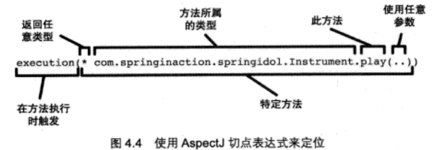

## Spring AOP 注解方式

#### 1、导入aspectj依赖

```xml
<dependency>
    <groupId>org.springframework.boot</groupId>
    <artifactId>spring-boot-starter-aop</artifactId>
</dependency>
```

> 在使用AOP时，如果使用的是xml方式，不需要引入额外的包
>
> 如果使用==@Aspect==注解方式，需要引入额外的包（aspectjweaver），因为spring直接使用==AspectJ==的注解功能，注意只是使用了它 的注解功能而已
>
> ==AspectJ==是动态代理的一种实现！而spring默认使用的就是AspectJ来实现的动态代理，spring自己的AOP就是使用AspectJ来实现的！当然你也可以使用其他的实现，如==cglib==

#### 2、启动类上配置允许使用AOP

```java
@EnableAspectJAutoProxy(proxyTargetClass = true)
```

#### 3、创建一个接口Human

```java
public interface Human {

    void say();
}
```

创建一个实现类

> 注意：要添加@Component注解，使之交给spring容器管理，否则aop不生效

```java
@Component
public class Man implements Human{
    @Override
    public void say() {
        System.out.println("男人说");
    }
}
```

#### 4、创建一个切面类

> @Aspect注解表明他是一个aop切面
>
> @Before表示下面的 test() 方法会在切入点方法 say() 之前调用
>
> execution里面是切入点表达式，前面的*表示返回值为任意类型，后面的是接口和方法路径，括号里的..表示任意参数。 注意：后面的路径中一定是接口Human（会对接口所有实现类生效），而不是Man这个类，否则该切面只对Man生效

```java
@Component
@Aspect
public class TestAspect {

    @Before("execution(* com.example.test.demotesta.intercepter.Human.say(..))")
    void test(){
        System.out.println("说之前");
    }

    @AfterReturning("execution(* com.example.test.demotesta.intercepter.Human.say(..))")
    void test2(){
        System.out.println("说之后");
    }
}
```

#### 5、在控制器中注入这个实现类，并在方法中调用say方法

> 一定要使用spring容器的bean，而不是new一个Man实例，否则aop不生效

```java
    @Autowired
    private Man man;

    @RequestMapping("aop")
    String aop(){
//        Man man = new Man();
        man.say();

        return "login";
    }
```

打印结果：

说之前
男人说
说之后


#### 6、再创建一个Woman类，注意不实现Human接口

```java
public class Woman {

    public void womensay(){
        System.out.println("女人说");
    }
}
```

在控制器中使用

```java
    @Autowired
    private Woman woman;

    @RequestMapping("aop")
    String aop(){
        woman.womensay();

        return "login";
    }
```

运行结果：

女人说

#### 7、解决切面在Woman类不生效的问题

> aop切面并没有生效，原因是切面类中的切入点表达式是Human接口的say()方法，而Woman类并没有实现Human接口，所以aop不生效。
>
> 需要修改切面类中切入点表达式，或者新建一个方法重新配置切点表达式。下面是直接修改了切入点表达式而非新建

```java
@Component
@Aspect
public class TestAspect {

    @Before("execution(* com.example.test.demotesta.intercepter.Human.say(..)) || execution(* com.example.test.demotesta.intercepter.Woman.say(..))")
    void test(){
        System.out.println("说之前");
    }

    @AfterReturning("execution(* com.example.test.demotesta.intercepter.Human.say(..)) || execution(* com.example.test.demotesta.intercepter.Woman.say(..))")
    void test2(){
        System.out.println("说之后");
    }
}
```

运行结果：

说之前
女人说
说之后

#### 8、切入点表达式的常见语法



```java
//限定该切点仅匹配的包是 com.sharpcj.aopdemo.test1,可以使用
execution(* com.sharpcj.aopdemo.test1.IBuy.buy(..)) && within(com.sharpcj.aopdemo.test1.*)
//在切点中选择 bean,可以使用
execution(* com.sharpcj.aopdemo.test1.IBuy.buy(..)) && bean(girl)
//同时将两个切入点配置在一起，共用一个增强通知
execution(* com.example.test.demotesta.Human.say(..)) || execution(* com.example.test.demotesta.Woman.say(..))
```

#### 9、五种通知类型


环绕通知

> 一些特殊场景需要使用环绕通知，比如计算方法执行耗时

```java
@Around("execution(* com.example.test.demotesta.intercepter.Human.say(..))")
void test3(ProceedingJoinPoint pj){
    try {
        System.out.println("Around aaa ...");  //方法执行前
        pj.proceed();   //原方法执行
        System.out.println("Around bbb ...");  //方法执行后
    } catch (Throwable throwable) {
        throwable.printStackTrace();
    }
}
```

运行结果：

Around aaa ...
男人说
Around bbb ...

#### 10、需要使用返回值和参数的情况

Human接口中添加方法

```java
public interface Human {

    void say();
    String pay(double price);
}
```

Man实现

```java
@Component
public class Man implements Human{
    @Override
    public void say() {
        System.out.println("男人说");
    }

    @Override
    public String pay(double price) {
        System.out.println(String.format("花%s块钱买东西",price));
        return "游戏机";
    }
}
```

切面类中添加切入点

```java
@Before("execution(String com.example.test.demotesta.intercepter.Human.pay(double)) && args(price)")
void test4(double price){
    System.out.printf("%s块钱",price);
}
```

运行结果：

31.0块钱
花31.0块钱买东西

#### 11、在环绕通知中使用参数

> 注意：和其他通知使用参数的方式一样，只不过这里参数price需要在pj参数之后，否则会报错

```java
@Around("execution(String com.example.test.demotesta.intercepter.Human.pay(double)) && args(price)")
void test5(ProceedingJoinPoint pj,double price){
    System.out.printf("%s块钱\n",price);

    try {
        System.out.println("Around aaa ...");
        pj.proceed();
        System.out.println("Around bbb ...");
    } catch (Throwable throwable) {
        throwable.printStackTrace();
    }
}
```

#### 12、先定义切入点方法，再配置通知

```java
@Pointcut("execution(String com.example.test.demotesta.intercepter.Human.pay(double)) && args(price)")
void cut1(double price){

}

@Around("cut1(price)")
void test5(ProceedingJoinPoint pj,double price){
    System.out.printf("%s块钱\n",price);

    try {
        System.out.println("Around aaa ...");
        pj.proceed();
        System.out.println("Around bbb ...");
    } catch (Throwable throwable) {
        throwable.printStackTrace();
    }
}
```