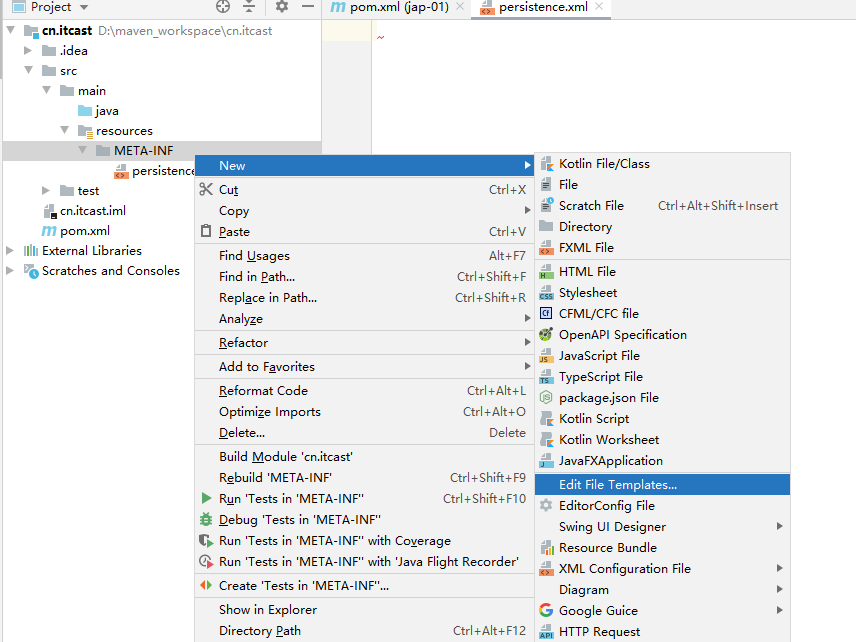
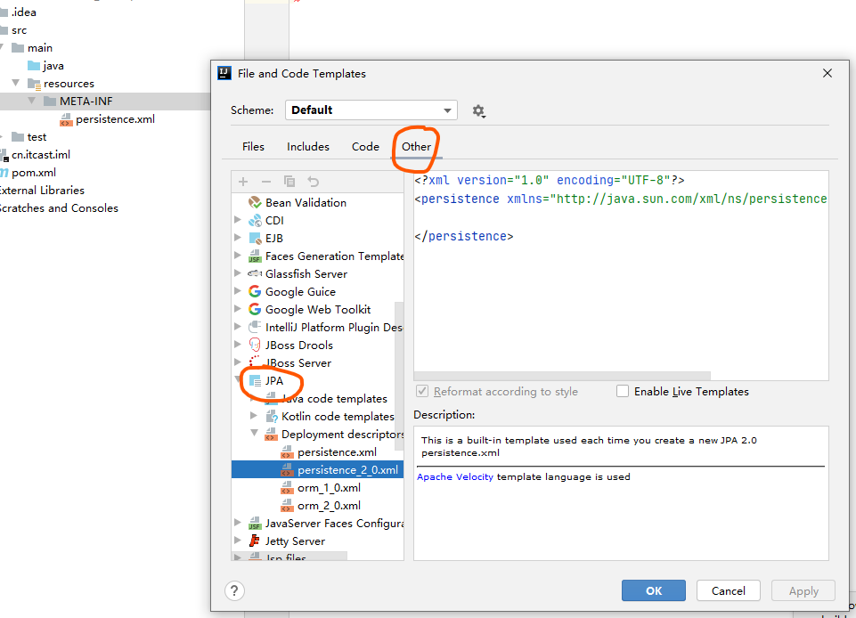
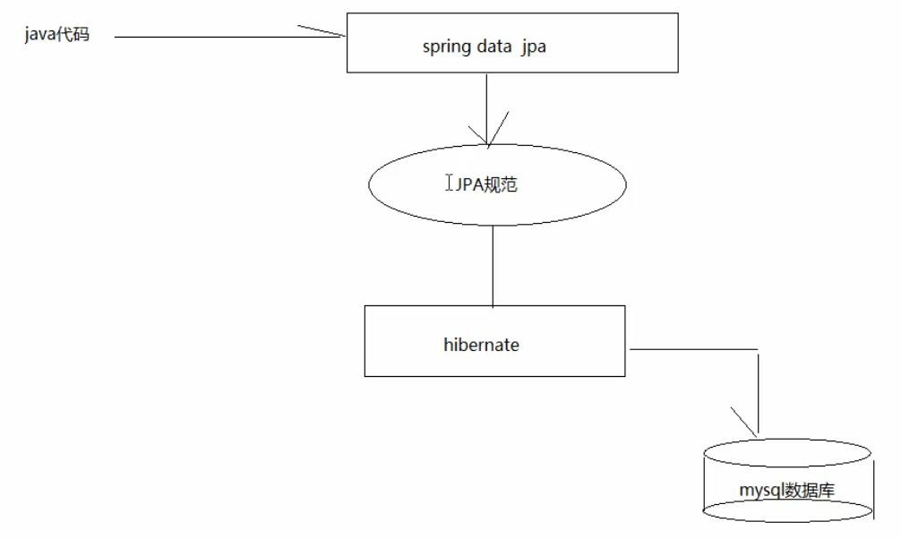
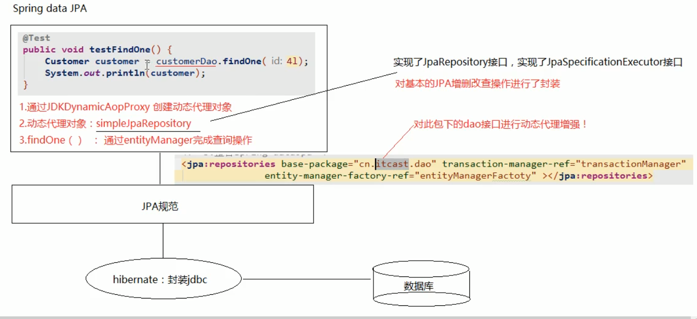

## JAP

#### 一、ORM思想

主要目的：操作实体类就相当于操作数据库表

关键就是要建立两个关系：实体类和数据表的关系，实体类属性和数据表字段的关系

效果：不再重点关注sql语句


#### 二、JPA规范

现如今的公司不会单独使用Hibernate这样的orm框架，而是配合JPA使用

JPA规范内部是由接口和抽象类组成，具体功能还是由各种各样的ORM框架执行


#### 三、环境搭建

###### 1、依赖

```xml
<dependency>
    <groupId>junit</groupId>
    <artifactId>junit</artifactId>
    <version>4.12</version>
    <scope>test</scope>
</dependency>

<dependency>
    <groupId>org.hibernate</groupId>
    <artifactId>hibernate-entitymanager</artifactId>
    <version>5.0.7.Final</version>
</dependency>

<dependency>
    <groupId>org.hibernate</groupId>
    <artifactId>hibernate-c3p0</artifactId>
    <version>5.0.7.Final</version>
</dependency>

<dependency>
    <groupId>log4j</groupId>
    <artifactId>log4j</artifactId>
    <version>1.2.17</version>
</dependency>

<dependency>
    <groupId>mysql</groupId>
    <artifactId>mysql-connector-java</artifactId>
    <version>5.1.46</version>
</dependency>
```

###### 2、核心配置文件

配置文件要放入类路径下的一个叫做  META-INF  的文件夹中，且配置文件命名为 persistence.xml

该xml文件的约束配置按如下方式获取





```xml
<?xml version="1.0" encoding="UTF-8"?>
<persistence xmlns="http://java.sun.com/xml/ns/persistence" version="2.0">

    <!--需要配置persistence节点
    持久化单元：
          name：持久化单元名称
          transaction-type：事务管理方式
                JTA：分布式事务管理（当不同的表分布在不同的数据库中时使用）
                RESOURCE_LOCAL：本地事务管理（单个数据库时使用）
    -->
    <persistence-unit name="myJPA" transaction-type="RESOURCE_LOCAL">
        <!--需要如下一些配置-->
        <!--jpa的实现方式-->
        <provider>org.hibernate.jpa.HibernatePersistenceProvider</provider>
        
        <!--数据库信息-->
        <properties>
            <property name="javax.persistence.jdbc.user" value="root"/>
            <property name="javax.persistence.jdbc.password" value="111111"/>
            <property name="javax.persistence.jdbc.driver" value="com.mysql.jdbc.Driver"/>
            <property name="javax.persistence.jdbc.url" value="jdbc:mysql://127.0.0.1:3306/xdd_class?useUnicode=true&amp;characterEncoding=utf-8&amp;useSSL=false&amp;serverTimezone=UTC"/>
<!--            <property name="javax.persistence.jdbc.url" value="jdbc:mysql://127.0.0.1:3306/xdd_class?useUnicode=true&characterEncoding=utf-8&useSSL=false&serverTimezone=UTC"/>-->

            <!--可选配置：jpa实现方式的配置信息，如hibernate的配置-->
            <!--是否显示sql-->
            <property name="hibernate.show_sql" value="true"/>
            <!--自动创建数据库表
                  create：如果有表先删除表再创建
                  update：如果有表不会创建表
                  none： 不会创建表
            -->
            <property name="hibernate.hbm2ddl.auto" value="create"/>
        </properties>
        
        
    </persistence-unit>
</persistence>
```


###### 3、库表创建

数据库中建立一张表user2，包含若干字段

###### 4、创建实体类

创建和表user2相对应的实体类，有如下几个重要的注解需要注意，主要用于建立实体类和数据库表的关系

主键的生成策略通过==GenerationType==注解的==strategy==属性设置，有如下几种策略：

> ==GenerationType.IDENTITY==    自增，要求底层数据库支持自动增长，如mysql支持自增
>
> ==GenerationType.SEQUENCE==  序列，要求底层数据库支持序列，如oracle支持序列，但是oracle不支持自增
>
> ==GenerationType.TABLE==    jap提供的一种机制，通过一张数据库表的形式帮助我们完成主键自增，由jpa实现自增
>
> ==GenerationType.AUTO==   由程序自动选择主键生成策略

```java
import javax.persistence.*;

@Entity                      //声明此类是一个实体类
@Table(name = "user2")       //配置实体类和表的映射关系
public class User {
    @Id    //声明主键
    @GeneratedValue(strategy = GenerationType.IDENTITY)   //声明主键的生成策略为自增长
    @Column(name = "id")     //数据库中字段名称
    private int id;

    @Column(name = "name")
    private String name;

    @Column(name = "pwd")
    private String pwd;

    @Column(name = "head_img")
    private String headImg;

    @Column(name = "phone")
    private String phone;

    @Column(name = "create_time")
    private String createTime;

    省略 Getter、Setter、ToString
}
```

#### 四、操作

###### 1、增

```java
/**
 * 测试jpa的保存
 */
@Test
public void testSave(){
    //1、加载配置文件创建工厂
    EntityManagerFactory myJpaFactory = Persistence.createEntityManagerFactory("myJPA");

    //2、获取实体管理器
    EntityManager entityManager = myJpaFactory.createEntityManager();

    //3、获取事务对象，开启事务
    EntityTransaction transaction = entityManager.getTransaction();
    transaction.begin(); //开启事务

    //4、完成增删改查操作
    User user = new User();
    user.setName("zzz");
    user.setPwd("111");
    user.setPhone("13574694039");
    user.setHeadImg("1.png");
    user.setCreateTime(new Date());

    entityManager.persist(user);   //保存

    //5、提交事务
    transaction.commit();

    //6、释放资源
    entityManager.close();
    myJpaFactory.close();
}
```

EntityManagerFactory是线程安全的

可以看出EntityManager是实际操作数据的类，他有如下方法：

>  getTransaction：创建事务对象
>
> presist：保存
>
> merge：更新
>
> remove：删除
>
> find/getRefrence：根据id查询


###### 2、删

```java
@Test
public void remove(){
    EntityManagerFactory myJpaFactory = Persistence.createEntityManagerFactory("myJPA");
    EntityManager entityManager = myJpaFactory.createEntityManager();
    EntityTransaction transaction = entityManager.getTransaction();
    transaction.begin(); //开启事务

    User user = entityManager.find(User.class, 17);
    entityManager.remove(user);

    transaction.commit();
    entityManager.close();
    myJpaFactory.close();
}
```

###### 3、改

```java
@Test
public void update(){
    EntityManagerFactory myJpaFactory = Persistence.createEntityManagerFactory("myJPA");
    EntityManager entityManager = myJpaFactory.createEntityManager();
    EntityTransaction transaction = entityManager.getTransaction();
    transaction.begin(); //开启事务

    User user = entityManager.find(User.class, 15);
    user.setName("更新");
    entityManager.merge(user);

    transaction.commit();
    entityManager.close();
    myJpaFactory.close();
}
```

###### 4、查

find：根据id查询

```java
public void find(){
    EntityManagerFactory myJpaFactory = Persistence.createEntityManagerFactory("myJPA");
    EntityManager entityManager = myJpaFactory.createEntityManager();
    EntityTransaction transaction = entityManager.getTransaction();
    transaction.begin(); //开启事务

    /**
     * find：根据id查找数据
     * 参数一：查询结果的数据类型
     * 参数二：要查询的主键值
     */
    User user = entityManager.find(User.class, 14);
    System.out.println(user);

    transaction.commit();
    entityManager.close();
    myJpaFactory.close();
}
```

getReference：根据id查询

```java
@Test
public void refrence(){
    EntityManagerFactory myJpaFactory = Persistence.createEntityManagerFactory("myJPA");
    EntityManager entityManager = myJpaFactory.createEntityManager();
    EntityTransaction transaction = entityManager.getTransaction();
    transaction.begin(); //开启事务

    /**
     * getReference：根据id查找数据
     * 参数一：查询结果的数据类型
     * 参数二：要查询的主键值
     */
    User user = entityManager.getReference(User.class, 14);
    System.out.println(user);

    transaction.commit();
    entityManager.close();
    myJpaFactory.close();
}
```

==find== 和 ==getReference==的区别：

> find：在执行find方法时就立即查询数据库，返回实体类对象
>
> getReference：在执行getReference时不会立即查询数据库，在使用实体类时才会去查询数据库，返回的是一个动态代理对象

###### 5、查询全部

使用spql语句的方式查询全部，==sql语句用于描述数据库表和字段，而jpql用于描述实体类和属性==

jpql

> 不可以写select *
>
> 可以写select count()
>
> 可以写select 属性

```java
/**
 * 使用jpql语句查询全部
 * jpql： from cn.itcast.domain.User
 * sql：  select * from user
 */
@Test
public void findAll(){
    EntityManagerFactory myJpaFactory = Persistence.createEntityManagerFactory("myJPA");
    EntityManager entityManager = myJpaFactory.createEntityManager();
    EntityTransaction transaction = entityManager.getTransaction();
    transaction.begin(); //开启事务

    String jpql = "from cn.itcast.domain.User";    //并不需要写全限定名，可以简写
    Query query = entityManager.createQuery(jpql);

    List resultList = query.getResultList();
    for (Object obj: resultList) {
        System.out.println(obj);
    }

    transaction.commit();
    entityManager.close();
    myJpaFactory.close();
}
```


###### 6、分页查询

```java
String jpql = "from User";
Query query = entityManager.createQuery(jpql);

//上面的from User表示查询全部，想实现分页查询需要配置参数
query.setFirstResult(1);   //起始索引
query.setMaxResults(2);    //每页查询的条数

List resultList = query.getResultList();
```


###### 7、统计查询

```java
String jpql = "select count(1) from User";    //并不需要写全限定名，可以简写
Query query = entityManager.createQuery(jpql);

Object singleResult = query.getSingleResult();   //仅单个结果
System.out.println(singleResult);
```


###### 8、条件查询

```java
String jpql = "from User where name like ?";   //参数占位
Query query = entityManager.createQuery(jpql);

//设置参数
query.setParameter(1,"ch%");

List resultList = query.getResultList();
```


###### 9、排序

```java
@Test
public void order(){
    EntityManagerFactory myJpaFactory = Persistence.createEntityManagerFactory("myJPA");
    EntityManager entityManager = myJpaFactory.createEntityManager();
    EntityTransaction transaction = entityManager.getTransaction();
    transaction.begin(); //开启事务

    String jpql = "from User order by createTime desc";    //并不需要写全限定名，可以简写
    Query query = entityManager.createQuery(jpql);

    List resultList = query.getResultList();

    transaction.commit();
    entityManager.close();
    myJpaFactory.close();
}
```


## SpringData Jpa

一个封装了JPA操作规范的java持久层框架，只需要编写dao层接口，不需要编写实现类



springdata jpa内部执行逻辑



 

#### 一、环境搭建

###### 1、依赖

```xml
<properties>
    <spring.version>5.0.2.RELEASE</spring.version>
    <hibernate.version>5.0.7.Final</hibernate.version>
    <slf4j.version>1.6.6</slf4j.version>
    <log4j.version>1.2.12</log4j.version>
    <c3p0.version>0.9.1.2</c3p0.version>
    <mysql.version>5.1.6</mysql.version>
</properties>

<dependencies>
    <!-- junit单元测试 -->
    <dependency>
        <groupId>junit</groupId>
        <artifactId>junit</artifactId>
        <version>4.12</version>
        <scope>test</scope>
    </dependency>

    <!-- spring beg -->
    <dependency>
        <groupId>org.aspectj</groupId>
        <artifactId>aspectjweaver</artifactId>
        <version>1.6.8</version>
    </dependency>

    <dependency>
        <groupId>org.springframework</groupId>
        <artifactId>spring-aop</artifactId>
        <version>${spring.version}</version>
    </dependency>

    <dependency>
        <groupId>org.springframework</groupId>
        <artifactId>spring-context</artifactId>
        <version>${spring.version}</version>
    </dependency>

    <dependency>
        <groupId>org.springframework</groupId>
        <artifactId>spring-context-support</artifactId>
        <version>${spring.version}</version>
    </dependency>

    <!-- spring对orm框架的支持包-->
    <dependency>
        <groupId>org.springframework</groupId>
        <artifactId>spring-orm</artifactId>
        <version>${spring.version}</version>
    </dependency>

    <dependency>
        <groupId>org.springframework</groupId>
        <artifactId>spring-beans</artifactId>
        <version>${spring.version}</version>
    </dependency>

    <dependency>
        <groupId>org.springframework</groupId>
        <artifactId>spring-core</artifactId>
        <version>${spring.version}</version>
    </dependency>

    <!-- spring end -->

    <!-- hibernate beg -->
    <dependency>
        <groupId>org.hibernate</groupId>
        <artifactId>hibernate-core</artifactId>
        <version>${hibernate.version}</version>
    </dependency>
    <dependency>
        <groupId>org.hibernate</groupId>
        <artifactId>hibernate-entitymanager</artifactId>
        <version>${hibernate.version}</version>
    </dependency>
    <dependency>
        <groupId>org.hibernate</groupId>
        <artifactId>hibernate-validator</artifactId>
        <version>5.2.1.Final</version>
    </dependency>
    <!-- hibernate end -->

    <!-- c3p0 beg -->
    <dependency>
        <groupId>c3p0</groupId>
        <artifactId>c3p0</artifactId>
        <version>${c3p0.version}</version>
    </dependency>
    <!-- c3p0 end -->

    <!-- log end -->
    <dependency>
        <groupId>log4j</groupId>
        <artifactId>log4j</artifactId>
        <version>${log4j.version}</version>
    </dependency>

    <dependency>
        <groupId>org.slf4j</groupId>
        <artifactId>slf4j-api</artifactId>
        <version>${slf4j.version}</version>
    </dependency>

    <dependency>
        <groupId>org.slf4j</groupId>
        <artifactId>slf4j-log4j12</artifactId>
        <version>${slf4j.version}</version>
    </dependency>
    <!-- log end -->


    <dependency>
        <groupId>mysql</groupId>
        <artifactId>mysql-connector-java</artifactId>
        <version>${mysql.version}</version>
    </dependency>

    <!-- spring data jpa 的坐标-->
    <dependency>
        <groupId>org.springframework.data</groupId>
        <artifactId>spring-data-jpa</artifactId>
        <version>1.9.0.RELEASE</version>
    </dependency>

    <dependency>
        <groupId>org.springframework</groupId>
        <artifactId>spring-test</artifactId>
        <version>${spring.version}</version>
    </dependency>

    <!-- el beg 使用spring data jpa 必须引入 -->
    <dependency>
        <groupId>javax.el</groupId>
        <artifactId>javax.el-api</artifactId>
        <version>2.2.4</version>
    </dependency>

    <dependency>
        <groupId>org.glassfish.web</groupId>
        <artifactId>javax.el</artifactId>
        <version>2.2.4</version>
    </dependency>
    <!-- el end -->
</dependencies>
```

###### 2、核心配置

applicationContext.xml

```xml
<?xml version="1.0" encoding="UTF-8"?>
<beans xmlns="http://www.springframework.org/schema/beans"
       xmlns:xsi="http://www.w3.org/2001/XMLSchema-instance" xmlns:aop="http://www.springframework.org/schema/aop"
       xmlns:context="http://www.springframework.org/schema/context"
       xmlns:jdbc="http://www.springframework.org/schema/jdbc" xmlns:tx="http://www.springframework.org/schema/tx"
       xmlns:jpa="http://www.springframework.org/schema/data/jpa" xmlns:task="http://www.springframework.org/schema/task"
       xsi:schemaLocation="
      http://www.springframework.org/schema/beans http://www.springframework.org/schema/beans/spring-beans.xsd
      http://www.springframework.org/schema/aop http://www.springframework.org/schema/aop/spring-aop.xsd
      http://www.springframework.org/schema/context http://www.springframework.org/schema/context/spring-context.xsd
      http://www.springframework.org/schema/jdbc http://www.springframework.org/schema/jdbc/spring-jdbc.xsd
      http://www.springframework.org/schema/tx http://www.springframework.org/schema/tx/spring-tx.xsd
      http://www.springframework.org/schema/data/jpa
      http://www.springframework.org/schema/data/jpa/spring-jpa.xsd">

    <!--spring 和 spring data jpa的配置-->

    <!-- 1.创建entityManagerFactory对象交给spring容器管理-->
    <bean id="entityManagerFactoty" class="org.springframework.orm.jpa.LocalContainerEntityManagerFactoryBean">
        <property name="dataSource" ref="dataSource" />
        <!--配置的扫描的包（实体类所在的包） -->
        <property name="packagesToScan" value="cn.itcast.domain" />
        <!-- jpa的实现厂家 -->
        <property name="persistenceProvider">
            <bean class="org.hibernate.jpa.HibernatePersistenceProvider"/>
        </property>

        <!--jpa的供应商适配器 -->
        <property name="jpaVendorAdapter">
            <bean class="org.springframework.orm.jpa.vendor.HibernateJpaVendorAdapter">
                <!--配置是否自动创建数据库表 -->
                <property name="generateDdl" value="false" />
                <!--指定数据库类型 -->
                <property name="database" value="MYSQL" />
                <!--数据库方言：支持的特有语法 -->
                <property name="databasePlatform" value="org.hibernate.dialect.MySQLDialect" />
                <!--是否显示sql -->
                <property name="showSql" value="true" />
            </bean>
        </property>

        <!--jpa的方言 ：高级的特性 -->
        <property name="jpaDialect" >
            <bean class="org.springframework.orm.jpa.vendor.HibernateJpaDialect" />
        </property>

    </bean>

    <!--2.创建数据库连接池 -->
    <bean id="dataSource" class="com.mchange.v2.c3p0.ComboPooledDataSource">
        <property name="user" value="root"></property>
        <property name="password" value="111111"></property>
        <property name="jdbcUrl" value="jdbc:mysql:///jpa" ></property>
        <property name="driverClass" value="com.mysql.jdbc.Driver"></property>
    </bean>

    <!--3.整合spring dataJpa-->
    <jpa:repositories base-package="cn.itcast.dao" transaction-manager-ref="transactionManager"
                   entity-manager-factory-ref="entityManagerFactoty" ></jpa:repositories>

    <!--4.配置事务管理器 -->
    <bean id="transactionManager" class="org.springframework.orm.jpa.JpaTransactionManager">
        <property name="entityManagerFactory" ref="entityManagerFactoty"></property>
    </bean>

    <!-- 4.txAdvice-->
    <tx:advice id="txAdvice" transaction-manager="transactionManager">
        <tx:attributes>
            <tx:method name="save*" propagation="REQUIRED"/>
            <tx:method name="insert*" propagation="REQUIRED"/>
            <tx:method name="update*" propagation="REQUIRED"/>
            <tx:method name="delete*" propagation="REQUIRED"/>
            <tx:method name="get*" read-only="true"/>
            <tx:method name="find*" read-only="true"/>
            <tx:method name="*" propagation="REQUIRED"/>
        </tx:attributes>
    </tx:advice>

    <!-- 5.aop-->
    <aop:config>
        <aop:pointcut id="pointcut" expression="execution(* cn.itcast.service.*.*(..))" />
        <aop:advisor advice-ref="txAdvice" pointcut-ref="pointcut" />
    </aop:config>


    <!--5.声明式事务 -->

    <!-- 6. 配置包扫描-->
    <context:component-scan base-package="cn.itcast" ></context:component-scan>
</beans>
```


#### 二、使用

###### 1、创建dao接口

需要继承两个接口，并且对泛型进行设置，基本的增删改查操作已经在继承的两个接口中定义，可直接使用

```java
/**
 * 符合SpringDataJpa的dao层接口规范
 *      JpaRepository<操作的实体类类型，实体类中主键属性的类型>
 *          * 封装了基本CRUD操作
 *      JpaSpecificationExecutor<操作的实体类类型>
 *          * 封装了复杂查询（分页）
 */
public interface CustomerDao extends JpaRepository<Customer,Long> ,JpaSpecificationExecutor<Customer> {
 
}
```

###### 2、基本使用

基本的增删改查操作可以直接进行

```java
@Test
public void testOther(){

    /**
     * 增
     * save：如果实体对象中没有主键值，则表示新增
     */
    User user = new User();
    user.setName("zzz");
    user.setPwd("111");
    user.setPhone("13574694039");
    user.setHeadImg("1.png");
    user.setCreateTime(new Date());
    User save = userDao.save(user);


    /**
     * 删
     */
    userDao.delete(save);

    /**
     * 改
     * save：实体类对象中包含主键值，则表示修改
     */
    User one = userDao.findOne(15);
    one.setName("更改2222");
    userDao.save(one);

    /**
     * 查询所有
     */
    List<User> all = userDao.findAll();
    System.out.println(all.size());

    
    //==========其他方法===========
    
    
    //查询全部记录数
    long count = userDao.count();
    System.out.println(count);

    //判断id为12的用户是否存在
    boolean exists = userDao.exists(12);

    /**
     * 注意和findOne的区别
     * findOne： 底层调用的是jpa的find
     * getOne：底层调用的是jpa的getReference    延迟加载
     *
     * 使用这个方法需要对方法加上@Transactional注解才不会报错
     */
    User one1 = userDao.getOne(13);
}
```

###### 3、jpql语句

如果接口中定义的基本的方法不能满足需求，可以自己定义方法，也无需实现类

```java
public interface TestUserDao extends JpaRepository<User,Integer>, JpaSpecificationExecutor<User> {

    /**
     * 配置jpql语句，使用@Query注解
     * @param name
     * @return
     */
//    @Query(value = "from User where name = ?1")   可以在问号后面绑定参数下标
    @Query(value = "from User where name = ?")
    List<User> findByName(String name);
}
```

更新操作

```java
public interface TestUserDao extends JpaRepository<User,Integer>, JpaSpecificationExecutor<User> {

    // @Query只表示查询，如果是更新操作还需要加@Modifying注解
    @Query(value = "update User set name = ?2 where id = ?1")
    @Modifying
    void updateUser(int id, String name);
}
```

```java
/**
 * 注意：更新或删除操作需要对方法加事务
 * 需要将自动回滚设置为false，否则springdata jpa会自动回滚，导致操作不生效
 */
@Test
@Transactional
@Rollback(value = false)
public void updateUser(){
    userDao.updateUser(1,"xiaoming");
}
```


###### 4、sql语句

上面是使用spql语句进行操作，当然也可以使用sql语句进行操作

参数占位操作和jpql一样

```java
public interface TestUserDao extends JpaRepository<User,Integer>, JpaSpecificationExecutor<User> {

    /**
     * 使用sql进行查询
     * 需要设置nativeQuery属性为true
     * @return
     */
    @Query(value = "select * from user2", nativeQuery = true)
    List<Object[]> findAllWithSql();
}
```

```java
@Test
public void findBySql(){
    List<Object[]> allWithSql = userDao.findAllWithSql();
    for(Object[] objects: allWithSql){
        System.out.println(Arrays.asList(objects).toString());
    }
}
```

运行结果：

[1, xiaoming, 3243242343, https://thirdwx.qlogo, 2342452, 2018-06-30 15:15:35.0]
[2, coffee, werewrew, https://thirdwx.qlogo.cn/mm, 56453445, 2018-06-30 16:42:30.0]
[3, niatouguai, werer45423, http://thirdwx.qlogo.cn/mm, 234235, 2018-06-30 18:28:23.0]


###### 5、方法名称规则查询

是对jpql更加深一层的封装，我们只需要按照SpringDataJpa提供的方法名称规则定义方法，不需要再去配置jpql语句，即可完成查询

==方法名的约定==：

查询以findBy开头，查询条件为对象中的属性名，首字母大写。SpringDataJpa在运行时会根据方法名进行解析

如：findByName                  表示根据用户名查询

```java
public interface TestUserDao extends JpaRepository<User,Integer>, JpaSpecificationExecutor<User> {

    /**
     *  根据方法名规则查询
     */
    List<User> findByPhone(String phone);
}
```

```java
@Test
public void findByPhone(){
    List<User> byPhone = userDao.findByPhone("111");
    for (User user: byPhone){
        System.out.println(user);
    }
}
```

其他例子：

findByNameAndPwd       多条件（And  | Or）

findByNameOrPwd

findByNameLike            根据name进行模糊查询

findByNameLikeOrPwd

findByNameIsNull


#### 三、动态查询

前面将的都是JpaRepository接口中的方法，而JpaSpecificationExecutor接口中包含一些动态查询的方法

其方法列表如下：

```java
查询单个对象
T findOne(Specification<T> var1);

查询列表
List<T> findAll(Specification<T> var1);

分页查询
    Pageable：分页参数
Page<T> findAll(Specification<T> var1, Pageable var2);

查询列表并排序
List<T> findAll(Specification<T> var1, Sort var2);

统计查询
long count(Specification<T> var1);
```

==Specifications== 表示查询条件

他是一个接口，我们需要定义实现类（一般使用匿名内部类），封装查询条件，该接口有一个方法如下：

```java
/**
  * root   查询的根对象，查询的任何属性都可以从根对象中获取
  * CriteriaQuery  自定义查询方式，一般不用
  * CriteriaBuilder  查询构造器，封装了很多查询条件
  */
Predicate toPredicate(Root<T> var1, CriteriaQuery<?> var2, CriteriaBuilder var3);
```

例子：

```java
@Test
public void findOne(){
    /**
     * 自定义查询条件
     * 接口中的泛型就是要查询的对象类型
     */
    Specification<User> spec = new Specification<User>() {
        /**
         * @param root  需要比较的属性
         * @param criteriaQuery
         * @param criteriaBuilder  查询方式
         * @return
         */
        public Predicate toPredicate(Root<User> root, CriteriaQuery<?> criteriaQuery, CriteriaBuilder cb) {
            //1、获取比较的属性
            Path<Object> name = root.get("name");
            /**
             * 2、构造查询条件
             * 第一个参数：需要比较的属性名
             * 第二个参数：当前需要比较的取值
             */
            Predicate predicate = cb.equal(name, "chen");  //等号匹配

            //第二个条件
            Path<Object> phone = root.get("phone");
            Predicate predicate2 = cb.equal(phone, "11111");

            //第三个条件   注意：像gt、lt、ge、le、like得到的path对象，要指定参数类型
            Path<Object> headImg = root.get("headImg");
            Predicate like = cb.like(headImg.as(String.class), "https%");

            //将两个条件拼接起来  and()   or()
            Predicate and = cb.and(predicate, predicate2, like);

            return and;
        }
    };

    User one = userDao.findOne(spec);
    System.out.println(one);   //打印查询结果
}
```


添加排序条件，修改上述代码

```
@Test
public void findOne(){

    Specification<User> spec = new Specification<User>() {....};

    /**
     * 设置排序条件
     */
    Sort sort = new Sort(Sort.Direction.DESC, "createTime");
    List<User> all = userDao.findAll(spec, sort);
    System.out.println(all);
}
```


分页查询

```java
@Test
public void page(){

    Specification spec = null;
    /**
     * 设置分页
     * 参数一：当前查询的页数   从0开始
     * 参数二：每页查询的数量
     */
    Sort sort = new Sort(Sort.Direction.DESC, "createTime");  //不需要排序可以去掉
    PageRequest pageRequest = new PageRequest(3, 2, sort);
    Page page = userDao.findAll(spec, pageRequest);

    System.out.println(page.getContent());    //结果集合列表
    System.out.println(page.getTotalElements());  //总条数
    System.out.println(page.getTotalPages());    //总页数

}
```


如何用实体类之间的关系描述表之间的关系

```java
@Entity                      
@Table(name = "user2")     
public class User {
    @Id    
    @GeneratedValue(strategy = GenerationType.IDENTITY)   
    @Column(name = "id")     
    private int id;

    @Column(name = "name")
    private String name;

    @Column(name = "pwd")
    private String pwd;

    @Column(name = "head_img")
    private String headImg;

    @Column(name = "phone")
    private String phone;

    @Column(name = "create_time")
    private Date createTime;

    /**
     * 设置表之间一对多的关系
     * @OneToMany 配置一对多
     *       targetEntity：对方对象的类型
     * @JoinColumn 配置外键
     *       name：外键字段名称
     *       referencedColumnName：参照主表的主键字段名称
     */
    @OneToMany(targetEntity = Customer.class)
    @JoinColumn(name = "cus_id", referencedColumnName = "id")
    private Set<Customer> cusList;
    
    Getter/Setter
```

```java
@Entity
@Table(name="cst_customer")
public class Customer {

    @Id
    @GeneratedValue(strategy = GenerationType.IDENTITY)
    @Column(name="cust_id")
    private Long custId;
    @Column(name="cust_address")
    private String custAddress;
    @Column(name="cust_industry")
    private String custIndustry;
    @Column(name="cust_level")
    private String custLevel;
    @Column(name="cust_name")
    private String custName;
    @Column(name="cust_phone")
    private String custPhone;
    @Column(name="cust_source")
    private String custSource;

    @ManyToOne(targetEntity = User.class)
    @JoinColumn(name = "cust_id", referencedColumnName = "id")
    private User user;
```